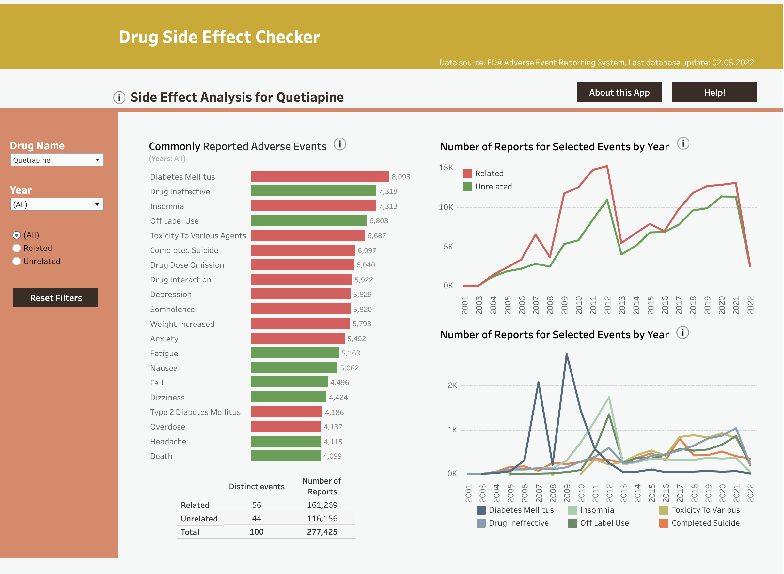
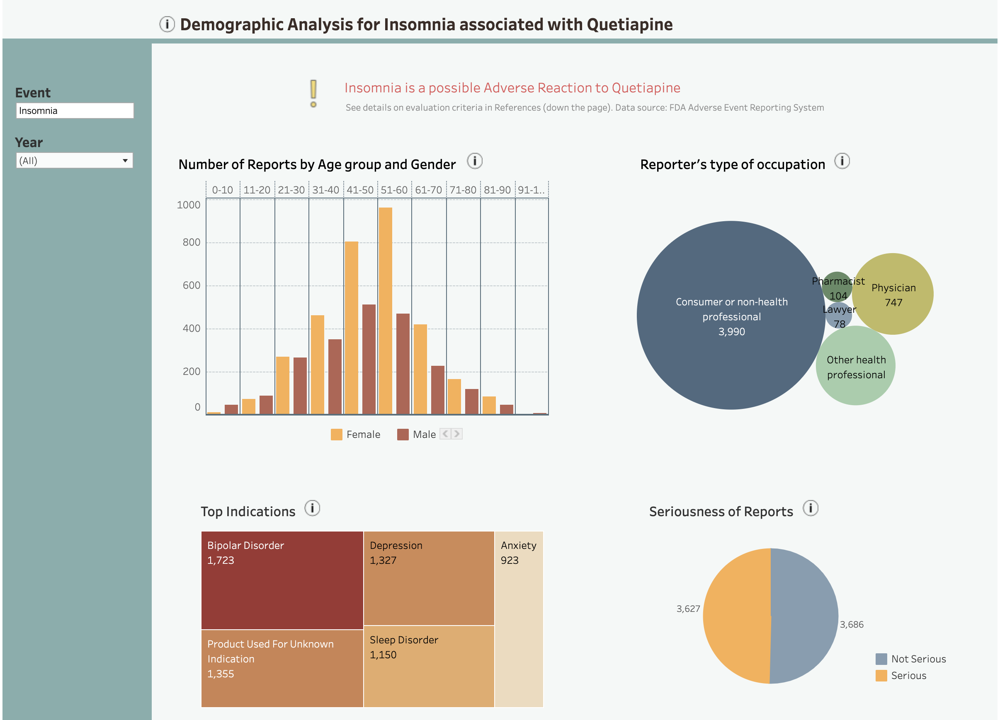

# AdverseDrugEventPipeline

> Drug Side Effect Checker - The Pharmacovigilance Dashboard Prototype
> 
> Developed for MSc thesis "Improving Understandability of Drug Safety Data. Design Principles for Drug Safety Dashboards" available at [link_to_thesis]

## Table of contents
* [General info](#general-info)
* [Illustrations](#illustrations)
* [Technologies](#technologies)
* [Setup](#setup)
* [Status](#status)
* [Contact](#contact)

## General info

## Illustrations
Below you can find example visualisations of drug safety data in the dashboard prototype.

<h4> General Overview of Drug Safety Profile </h4>

<h4> Selected in-depth analysis for a selected drug and one selected side effect </h4>

## Technologies
* Python 3.8.12
* Pandas 1.3.4
* Selenium 4.0
* BeautifulSoup4 4.7.1

## Setup

## Status
Project is _in progress_. TODO: 
- [ ] Rewrite Readme
- [x] Add .xlsx files

## Contact
Created by Malwina Kotowicz (mailto:m_kotowicz@hotmail.com) and Cláudio Pires (mailto:claudiofmpires@gmail.com ) - feel free to contact us!
